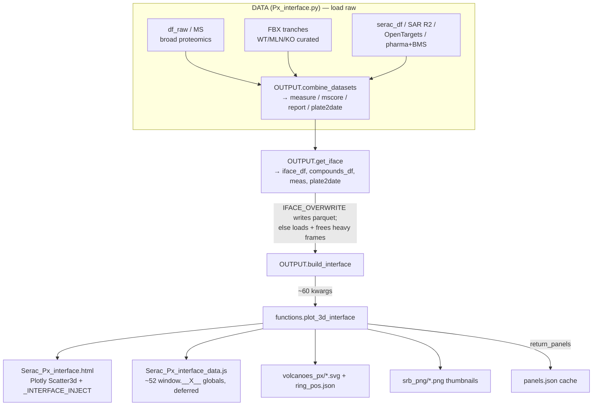

# Px 3D Gene Interface — Architecture

How the interactive 3D target browser is built, from raw exports to the standalone HTML you
open in a browser. This is the durable map of *how the pieces fit together*; day-to-day state and
decisions live in [`wiki/wiki.md`](../wiki/wiki.md).

> **Scope:** the interface-build path only — `python/Px_interface.py`,
> `plot_3d_interface` + the `_INTERFACE_INJECT` template + the volcano helpers in
> `python/functions.py`, and `config/config.yaml`. Unrelated code (OpenTargets scoring, GSEA/ORA
> enrichment, plate ablation, autoresearch) is out of scope.

---

## 1. Data flow at a glance



**One dot per gene**, positioned by three axes: **x = SAR predictability (R²)**, **y = OpenTargets
association**, **z = MS score**. Hovering a dot opens the compound panel (structures only). **Clicking**
a dot pins the panel and marks the gene with a **green ring**; volcanoes then appear on hovering a
compound row (WT/MLN/KO stems are linked by a cross-plate hover trace). Esc/✕ unpins and reverts the ring.

The whole thing is **static + offline**: one HTML, a deferred `_data.js` sidecar, a folder of SVG
volcanoes, and thumbnails. No server; it runs from a `file://` double-click.

---

## 2. The build pipeline (`python/Px_interface.py`)

Three classes: **`PARAMS`** (reads `config.yaml`), **`DATA`** (loads raw inputs), **`OUTPUT`**
(combines + builds + renders).

| Step | Method | What it produces |
|---|---|---|
| Load | `DATA.load_new_df` / `load_old_df` / `load_chemical_lib_df` | `df_raw`, `MS`, `FBX_MEASURE/MSSCORE/REPORT`, `serac_df`, `target2R2_df`, `uc2compound` |
| Combine | `OUTPUT.combine_datasets` | `measure`, `mscore`, `report`, `plate2date` (FBX wins on shared experiments / (gene,plate) / contrasts) |
| Validation lists | `OUTPUT.get_de_validated` | `validated_targets`/`devalidated_targets`, `validated_compounds`/`devalidated_compounds` (FBXO31 ligase-dependent vs not) |
| Render inputs | `OUTPUT.get_iface` | **the four render inputs** — `iface_df`, `compounds_df`, `meas`, `plate2date` |
| Render | `OUTPUT.build_interface` | delegates to `plot_3d_interface`; owns colour dicts + the panels.json cache |

### The four render inputs (`get_iface`)

- **`iface_df`** — one row per gene: `R2` (SAR), `association_score` + top `disease_area`
  (OpenTargets, ranked by `PRIORITY_DISEASE_AREAS`), `ms_score`. Genes with `R2 > PHARMA_R2_CUTOFF`
  that are in the pharma/BMS lists get `disease_area = 'pharma'`/`'BMS'`.
- **`compounds_df`** — one row per (gene, compound, plate) significant-**down** hit, plus report
  metadata, SMILES, `molecule_batch_id`, and **validation-stem completion rows** (`is_completion=True`):
  a gene significant in a stem's WT but not its KO gets a ride-along KO row *iff* the compound was
  actually run there and the gene was measured (else the condition is correctly omitted).
- **`meas`** — the volcano source (unified `measure`, noisy plates dropped, 0.0 p-values floored).
- **`plate2date`** — `{plate: date}` for the date-nested Plates filter.

### `IFACE_OVERWRITE` (the big switch)

`True` → rebuild the four inputs and **save** them to `IFACE_DIR/` (parquet + json).
`False` → **load** them back and free the heavy upstream frames (`df_raw`, `FBX_*`, `measure`…),
so you can re-render fast without re-running the combine. **Coupled with the panels/volcano caches
(§4).**

---

## 3. `plot_3d_interface` (functions.py:3951)

Keyword-only render function (~60 kwargs). Pipeline inside:

1. **Filter + highlight** (`4103+`) — drop NaN-axis / excluded / z-clipped genes (`must_include`
   bypasses all). Corner-distance rank picks the highlight set. **When `range_sliders=True`,
   `highlighted` is replaced by *all* plotted genes** so every gene gets a compound panel (the
   client recomputes the colour/grey split live). This is why the panel build is large — and why
   the panels cache exists.
2. **Compound panels** — either **load from `panels=`** (cache) or **rebuild**: thumbnails +
   `custom[gene]` blobs + `tasks` (volcano render list) + plate/activity lists.
3. **Volcano render pass** (§4) — fills each panel's volcano slot, writes SVGs, accumulates
   `ring_pos`.
4. **Stem trace** — `stem_trace[vk][gene] = [fx,fy,aspect,isHit]` from `custom` + `ring_pos`
   (runs on **both** the fresh-render and the cache path).
5. **Build the figure** — traces in a fixed order (below), `ranges_cfg`, then serialise ~52
   `window.__X__` globals into the deferred `_data.js` and splice in `_INTERFACE_INJECT`.

### Trace-index invariants (load-bearing — the JS depends on this order)

| Index | Trace | Notes |
|---|---|---|
| `0` | grey backdrop (all genes) | `opacity=0`, `visible=True` — anchors the scene autorange. **Never** in `areaTraces`. |
| `1` | area **ring underlay** | larger dot per visible gene in the ring colour, drawn before the fills so the rim = the ring (gl3d caps `marker.line.width`). Repainted by `applyRanges` from the masks. `→ __AREA_RING_TRACE__`. |
| `2..N+1` | one per `disease_area` + a `control` trace | recorded in `area_trace_indices`; **only these are re-sliced by the sliders**. `showlegend` only in D mode. Fills have `marker.line.width=0` (ring comes from the underlay). |
| `N+2` | pin **ring underlay** | pin-overlay rings; repainted by `buildPinTrace`. `→ __PIN_RING_TRACE__`. |
| `N+3` | pin overlay (fill) | empty; driven by search/pins. **Excluded** from `area_trace_indices` so filters never hide a pin. `→ __PIN_TRACE__`. |
| `N+4..N+6` | 3 validation legend proxies | one `[None]` point each (gl3d won't show a legend key for a truly empty trace). The V/D toggle flips `showlegend` between these and the disease traces. `→ __VAL_LEGEND_TRACES__`. |

**Do not reorder these.** Coordinates for the area traces are also emitted as plain arrays in
`__AREA_DATA__` because Plotly stores `gd.data[ti].x` as base64 `{dtype,bdata}`, not JS arrays.

---

## 4. Volcano rendering + cache + stem trace (functions.py:6030+)

Each `(focal gene, experiment/contrast)` gets a small **interactive SVG** volcano: a rasterised
grey non-significant cloud + vector significant points carrying `<title>` tooltips, with the focal
gene ringed (`gid="tgt-ring"`).

- **`_volcano_svg_string`** — the renderer; returns `(svg, fx, fy, aspect)` (ring centre as image
  fractions) when `return_pos`.
- **`_volcano_render_worker`** — module-level (so joblib/loky can pickle it by reference); the
  parallel render path.
- **`_volcano_cache_fname`** — **single source of truth** for the on-disk filename.

### ⚠️ The cache is identity-keyed, NOT data-keyed

`_volcano_cache_fname` hashes `'{version}|{gene}|{key}|{xlim0}|{xlim1}|{size_px}|{ext}'` — **not**
the underlying p-values/logfc. So **changing the data does not invalidate cached images.** After a
data change you must explicitly re-render via `recompute_volcanoes` /
`floor_zero_pvalues_and_refresh_volcanoes`, or the interface serves stale volcanoes as cache hits.
`xlim`/`size_px` **must** match between `plot_3d_interface` and any recompute call or filenames
won't align.

### The `'v2'` salt (validation plates only)

Only volcanoes whose plate name ends in a validation suffix (WT/MLN/KO) are salted with
`version='v2'`. These are the only ones that carry the `tgt-ring` marker and a `ring_pos` entry.
Every other volcano keeps its unversioned filename → stays a cache hit. **`stem_trace` looks up
`ring_pos` with the `'v2'`-salted name**, so the render-pass salt and the stem-trace lookup literal
are coupled — bumping one requires bumping the other.

### Cross-plate hover trace

`ring_pos` lives only on disk (`volcanoes_px/ring_pos.json`) and in memory — it is **never** injected
to the browser. The server derives `stem_trace` from `ring_pos + custom` and injects
**`__STEM_TRACE__`**. The client draws the trace polyline from those fractions (+ `<object>` rect +
letterbox math), so it works over `file://` and http **without** reading into the SVG's
`contentDocument` (which `file://` blocks). See [`wiki/wiki.md`](../wiki/wiki.md) for the full trace UX.

---

## 5. The client (`_INTERFACE_INJECT`, functions.py:1263-3513)

One `<style>…</style><div>…</div><script>…</script>` blob appended before `</body>`. All logic runs
in a single `DOMContentLoaded` handler that reads the injected globals and paints DOM — it never
fetches and never rebuilds the Plotly figure.

### `applyRanges` is the hub

`recolor3d = applyRanges` — **every** filter / colour / pin / session change funnels through it. It
recomputes a per-point boolean mask, mutates `gd.data[ti].x/y/z/text/customdata/marker` in place,
calls `Plotly.redraw(gd)` (not `restyle` — unreliable on gl3d), then refreshes labels, the pin
overlay, and the count.

```
mask(gene) = soloPins ? isPinned(gene)
           : inSliderRange(x,y)  # SAR + association only; z (MS) is NOT tested on the gene's max
             AND geneHasVisibleCompound   # honours plate + activity + MS-slider ticks per experiment
             AND depAllowed AND confAllowed AND lofAllowed AND valAllowed
             AND (COLOR_MODE≠'V' OR valCatShown[category])   AND not hidden
```

**MS (z) slider filters per compound experiment, not the gene max.** The dot's z stays at the gene's
max MS so genes keep their position under any filter. The z-slider window (`msLo/msHi`, set in
`applyRanges`) instead filters each compound experiment by its OWN per-(gene,compound,plate) MS score,
carried in each panel plate-row at **index 8** (`pl[8]`; `null` on completion rows, which bypass it).
`msOk(pl)` gates every real plate-row inside `visPlates` + `geneHasVisibleCompound`, so out-of-range
experiments prune from the compound panel / hover / export like the Plate/Activity ticks, and a gene's
dot drops when no in-range experiment remains — while its plotted position never moves. The per-entry
score comes from the same metric as the position (`FBX_MSSCORE` per uniquecontrast ∪ `df_raw`), so a
gene's largest per-entry MS never exceeds its plotted z.

### Feature blocks (all piggyback on `applyRanges`)

- **Filters** — Plates (date-nested + a validation-stem sub-block), Activity, Controls/Contaminants,
  DepMap / Confidence / LoF / Target-validation / Compound-validation. Each ticklist calls
  `recolor3d` on change.
- **Range sliders** — 3 dual-handle sliders with click-to-edit readouts.
- **Colour V/D toggle** — V = FBXO31 validation (light fill + dark ring via `valFillOf`/`valRingOf`),
  D = disease-area colours. The toggle flips `showlegend` between the disease traces and the 3
  proxy legend traces; in V, `plotly_legendclick`/`doubleclick` on a proxy key is intercepted
  (returns `false`) to toggle/isolate `valCatShown` categories.
- **Pins / hide / solo** — a pin overlay trace no filter touches; double-click the master toggle for
  "only pinned" (solo) view.
- **Session save/load** (`.iface`) and **shareable URL hash** — a hash is just a partial session
  replayed through the same `apply()`.

### Cross-block "hooks"

The template is split across many IIFEs. They communicate through no-op function vars declared
up-front (`recolor3d`, `setColorModeHook`, `setMode2DHook`, `buildPinTraceHook`,
`applySessionHook`, `syncPlateUIHook`, …) that each IIFE assigns later. **IIFE order is
load-bearing** — e.g. the colour block calls `recolor3d`, which the range block assigns.

---

## 6. The JS ↔ Python contract

Python serialises state into ~52 `window.__X__` globals in the deferred `_data.js`; the template
reads them. Every active global is both set and read (no orphans). Heavy per-gene data lives in
`__GENE_COMPOUNDS__`, keyed by gene name — each trace's `customdata` is just that name.

### Core in-memory shapes

- **`custom[gene]`** → `__GENE_COMPOUNDS__`. A list of entries; entry 0 is
  `['__META__','',meta_str,'','','']`; each compound entry is 6-slot:
  `[compound_id, thumb_token, best_logfc, entry[3], meta_html, sublabel]`.
- **`entry[3]`** — either a list of **plate_rows** (plate-aware) or a scalar volcano token.
- **plate_row (8 slots)** — the join between panels, volcanoes, and the trace:

  | idx | field | notes |
  |---|---|---|
  | 0 | plate | |
  | 1 | logfc str | |
  | 2 | volcano token | filename (path/svg) or base64/data-URI (b64); `''` until the render pass fills it |
  | 3 | activity level | e.g. `'Single (1)'` |
  | 4 | n_genes str | |
  | 5 | molecule_batch_id | export / volcano-label id |
  | **6** | **is_completion** 0/1 | ride-along non-significant validation-stem row; bypasses the activity filter; **excluded** from counts/export/gene-active test |
  | **7** | **vk** (contrast id) | set **only** on validation-suffix plates; used as `.vcell data-vk` and the `__STEM_TRACE__` key |

- **`area_data[]`** → `__AREA_DATA__`. One `{x,y,z,gene,hover,color}` per colour trace, index-aligned
  with `ranges_cfg.areaTraces`.
- **`ranges_cfg`** → `__RANGES__`. `{x/y/z:{min,max,step,lo,hi,label}, areaTraces:[…], labelMax}`.
  `null` when `range_sliders=False` — the whole slider/count/export/pin machinery is gated on
  `if (R && Plotly)`.
- **`stem_trace`** → `__STEM_TRACE__`. `{vk: {gene: [fx,fy,aspect,isHit]}}`.
- **`gene_size`** → `__GENE_SIZE__`. `{gene: px}` — a **static** dot size: how many DISTINCT
  compounds the gene is a significant (non-`is_completion`) hit in, across ALL plates/activities,
  bucketed by `size_buckets` (`__SIZE_BUCKETS__`, default `[6,8,10,12,15,20]` for counts 1,2,3,4,5,>5).
  Applied per-point via `sizeOf` in both `applyRanges` (`marker.size = ft.map(sizeOf)`) and
  `buildPinTrace`, in **both** colour modes; a matching **size key** (`#size-legend`) is docked above
  the top-right gene legend (`positionSizeLegend`, which nudges `legend.y=0.88` — set in `update_layout`
  and re-applied by `fitBox` — to make room). It is a fixed gene property — the filters change which
  dots *show*, never their size. (The old bottom-left `#axis-legend` + its `__AXIS_LABELS__`/`__AXIS_HELP__`
  globals were removed 2026-07-21; axis meanings live on the range-panel slider labels.) The **SAR (x) axis
  title is shown in 3D only** as a *scene* annotation appended by `refreshLabels` at the bottom x-edge
  (data coords → rides the cube). gl3d always draws that axis on the MS floor and the viewer-facing
  association edge, so the label sits at `z=z_min`, `y=(eye.y·eye.z>0)?y_max:y_min` (calibrated against
  the rendered x-ticks at default/side/below cameras — a single per-axis sign rule fails because gl3d's
  edge choice is coupled across the whole camera). A camera-guarded `plotly_relayout` listener re-runs
  `refreshLabels` on rotate, and `setMode` re-runs it on the 2D/3D toggle. Guarded to 3D (2D looks down that axis).
- **Ring underlay** → `__AREA_RING_TRACE__` / `__PIN_RING_TRACE__` / `__RING_PX__`. gl3d caps outline
  width, so each dot's ring is a larger dot (size `= fill + 2*RING_PX`, ring colour) drawn in a
  dedicated trace *under* the fills. `applyRanges` repaints the area underlay from the masks
  (per-point colour `valRingOf` in V / `#333` in D); `buildPinTrace` repaints the pin underlay. `RING_PX`
  comes from `plot_3d_interface(ring_px=)` ← config `GENE_RING_PX`.

### Session `.iface` / URL-hash keys

`.iface` = `{version, showPins, soloPins, pinnedGenes, pinnedCompounds, hiddenGenes,
hiddenCompounds, filters:{…}, ranges:{x/y/z:[lo,hi]}, mode2d, colorMode, camera}`.
Hash keys: `p=` (exact plate list), `pg`/`pc` (pinned), `hg`/`hc` (hidden), `sp=0` (pins hidden),
`so=1` (solo), `cm=D` (disease colour).

---

## 7. Invariants & gotchas (read before editing)

- **Volcano cache is identity-keyed, not data-keyed** — data changes need an explicit re-render
  (§4). `xlim`/`size_px` must match everywhere.
- **`'v2'` salt** couples the render pass and the `stem_trace` lookup — bump both or neither.
- **Trace order** (backdrop → colour/control → pin → 3 val-legend) must not change; the JS uses
  fixed indices (`__PIN_TRACE__`, `__VAL_LEGEND_TRACES__`, `areaTraces`).
- **Never read `gd.data[ti].x`** — coords are base64; read `__AREA_DATA__` instead.
- **`ranges_cfg=None` (no sliders)** silently removes sliders/count/export/pins (all gated on `if (R && Plotly)`).
- **`IFACE_OVERWRITE` couples with the caches** — `True` rebuilds the inputs *and* the referenced
  thumbnail/volcano files; loading `panels.json` while those files are missing yields broken
  thumbnails/volcanoes with no error. The **stem trace builds on both paths** (from `custom` +
  `ring_pos.json`), so `IFACE_OVERWRITE=false` keeps the gene linking.
- **`_data.js` is a deferred `<script src>`** (not `fetch`) on purpose: `fetch()` of a local file is
  CORS-blocked under `file://`; `defer` keeps first paint fast while guaranteeing globals are set
  before `DOMContentLoaded`.
- **gl3d caps `marker.line.width`** — a thick outline is impossible on scatter3d (verified: width
  3.5 vs 8 render identically). Dot **rings are drawn as a larger underlay dot** (fill + `2*RING_PX`,
  ring colour) beneath each fill, in a dedicated ring-underlay trace rendered *before* the fills.
  No z-fighting (fill and underlay share the exact coordinate → trace order breaks the depth tie).
  Fills therefore set `marker.line.width=0`; only the SVG legend swatches still use `marker.line`.
- **Browsers cache `_data.js` by filename** — after a rebuild, hard-refresh (`Ctrl+Shift+R`) or the
  page may serve a stale sidecar.

---

## 8. Colours & config

- `config.yaml`: `ACTIVE_C` (pharma dot), `BMS_C` (BMS dot), `VALIDATION_PLATE_SUFFIXES`
  (`[WT, MLN, KO]`), `GENE_SIZE_BUCKETS` (6 dot px for #significant-compounds = 1,2,3,4,5,>5),
  `GENE_RING_PX` (ring rim thickness in px; underlay dot = fill + 2×this).
- `PRIORITY_DISEASE_AREAS` (module constant in `Px_interface.py`) is the **single source of truth**
  for disease-area ranking; `build_interface` asserts `DISEASE_AREA_COLORS` covers it.
- `VALIDATION_COLORS` (fill + ring per category) is defined in `build_interface` and defaulted once
  in `plot_3d_interface`; injected as `__VALIDATION_COLORS__`.

---

## 9. Testing

`tests/make_synthetic.py` generates a deterministic fixture (synthetic data — no real structures);
`tests/test_px_interface.py` runs the whole pipeline end-to-end (19 tests), including a regression
test that the stem trace builds on **both** the fresh-render and the `IFACE_OVERWRITE=false` cache
path. Run: `conda run -n ML python -m unittest tests.test_px_interface`.
