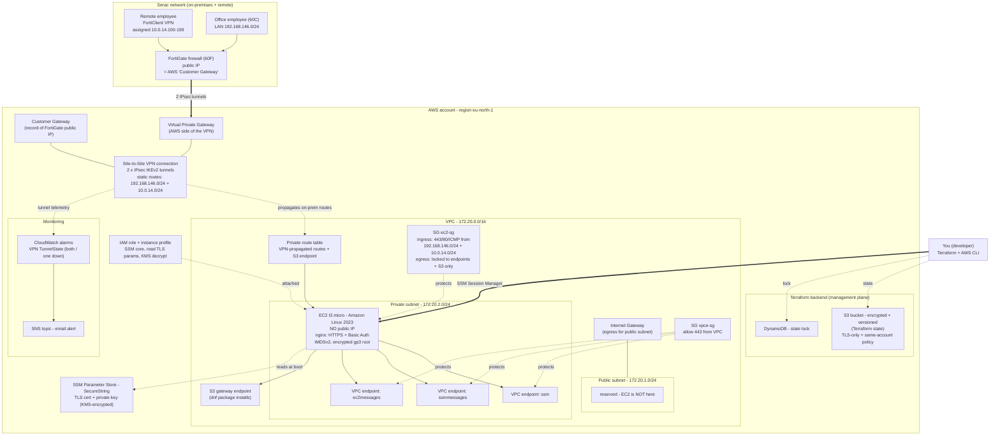
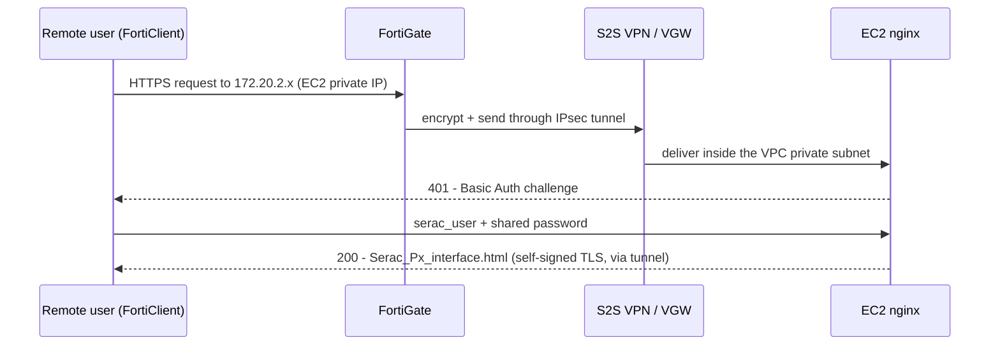
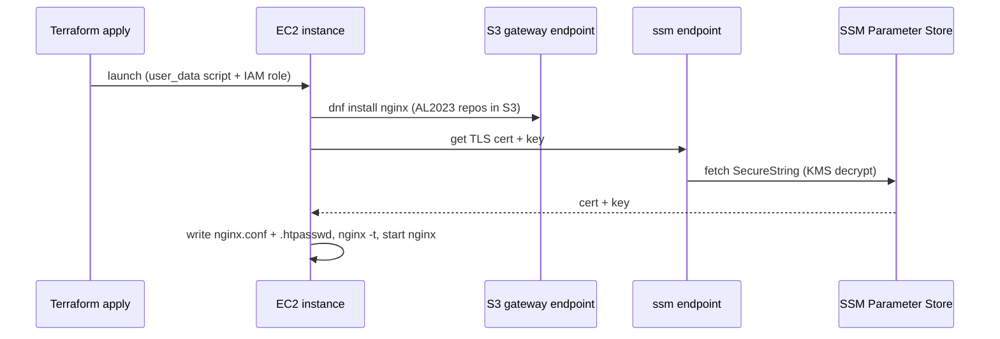

# Px interface — AWS architecture diagrams

Visual companion to `aws_architecture_learn.md` (which explains every piece) and `aws_docs.md`
(decisions + runbook). Reflects the Terraform stack in `aws-vpn/` (in-repo).

---

## 1. Full infrastructure map

How every component connects — from a Serac employee's laptop to the EC2 instance in AWS.

---

## 2. Runtime: a user opening the interface

What happens when you (remote, on FortiClient) load the page. Nothing is ever public — the whole
exchange rides inside the encrypted VPN tunnel.

---

## 3. Boot: how the EC2 configures itself

At first launch the instance has no software on it — `user_data` builds it, pulling everything from
inside AWS (no internet, no NAT) thanks to the VPC endpoints.

