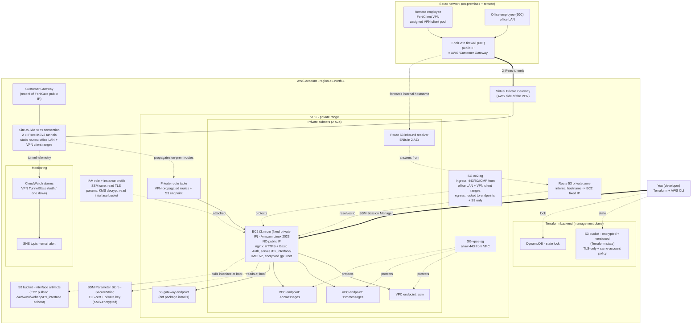
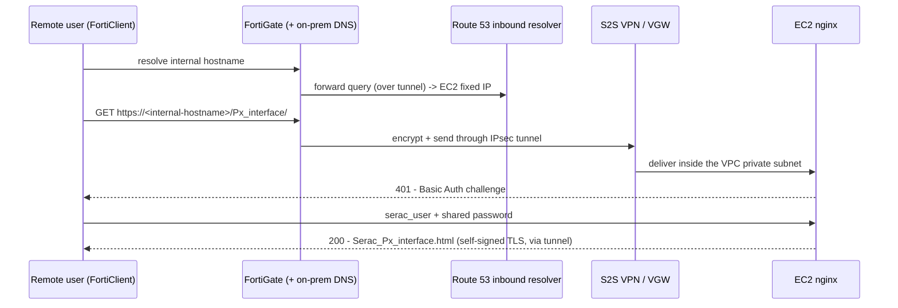
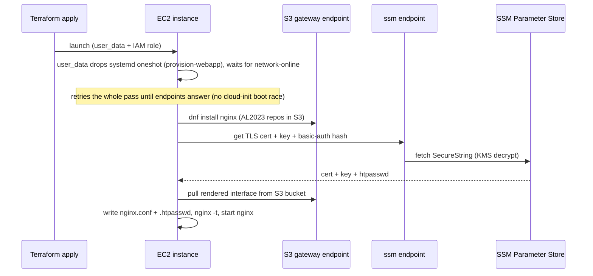

# Px interface — AWS architecture diagrams (shareable)

Redacted architecture overview for external review. Account identifiers, the Terraform state bucket
name, and internal IP addresses / CIDR ranges have been removed; topology and services are unchanged.

---

## 1. Full infrastructure map

How every component connects — from a Serac employee's laptop to the EC2 instance in AWS.

---

## 2. Runtime: a user opening the interface

What happens when you (remote, on FortiClient) load the page. Nothing is ever public — the whole
exchange rides inside the encrypted VPN tunnel.

---

## 3. Boot: how the EC2 configures itself

At first launch the instance has no software on it — `user_data` builds it, pulling everything from
inside AWS (no internet, no NAT) thanks to the VPC endpoints.

