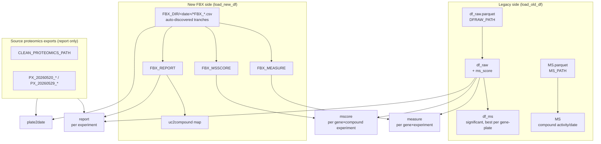

# Data transformation — how `measure`, `mscore`, `report` are built

How the interface's three unified tables (**`measure`**, **`mscore`**, **`report`**) — plus `plate2date` —
are derived from the raw inputs, and how the **legacy** (`df_raw` / `MS`) and **new FBX** sides are loaded
first. All logic lives in `python/Px_interface.py`: loading in `DATA` (`load_old_df`, `load_new_df`,
`load_chemical_lib_df`, …), unifying in `OUTPUT.combine_datasets`.

> **Golden rule:** on any experiment present in both sides, **FBX is the source of truth** — it overrides
> the legacy `df_raw`. The join key is almost always **`uniquecontrast`** (one compound × plate experiment).

---

## 0. Pipeline at a glance



Everything downstream (the 3D interface, the reconcile notebook) consumes `measure`, `mscore`, `report`,
`plate2date`, plus `serac_df` (compound library), `contaminants`, and OpenTargets `assoc`.

---

## 1. Original input files (config keys)

| Config key | File | Feeds |
|---|---|---|
| `DFRAW_PATH` | `df_raw.parquet` (legacy broad MS) | `df_raw`, `df_ms` |
| `MS_PATH` | `MS.parquet` (legacy compound metadata) | `MS` |
| `FBX_DIR` | date-named tranche folders, each with `*FBX_{MEASURE,MSSCORE,REPORT}*.csv` | `FBX_MEASURE/MSSCORE/REPORT` |
| `GENE_SAR_OUT` | `…geneSAR_R2_full_genome.csv` | `target2R2_df` (SAR R²) |
| `CLEAN_PROTEOMICS_PATH`, `PX_20260520_*`, `PX_20260529_*` | source proteomics exports (CDD / DB) | `report` metadata + `plate2date` |
| `CHEMLIB_PATH` (or CDD Vault if `CHEMLIB_OVERWRITE`) | SERAC compound library (collections AK/AJ) | `serac_df` |
| `CONTAMINANTS` | contaminant `Molecule Name` list | `contaminants` |
| `CONTROLS` | control-compound list (currently empty) | `control_compounds` |
| `OT_CACHE` | OpenTargets target–disease parquet | `assoc` (OT `overall_score` max per gene) |
| `GENE_RESEARCH` | per-gene degradation-research JSON | `gene_research` |

---

## 2. Legacy side — `df_raw`, `df_ms`, `MS` (`load_old_df`)

**`df_raw`** — the broad MS table, one row per **(gene, compound, plate)** experiment
(`genes`, `MSPlate`, `uniquecontrast`, `logfc`, `pvalue`, `significant`, `MoleculeBatchID`, …):

1. `read_parquet(DFRAW_PATH)` then `dropna()`.
2. `-log10(p-value)` column = `-np.log10(pvalue)`.
3. **`ms_score`** = `clip(-(-log10(p)) · logfc, 0, 100)` — the MS-score formula. For a **down** hit
   (`logfc < 0`) this is positive; **up** hits clip to 0. Capped at 100.
4. sort by `ms_score` desc.

**`df_ms`** — `df_raw[significant == 1]` collapsed with `groupby(['genes','MSPlate']).first()` → the legacy
"best significant compound per gene-plate". (Since the `mscore` rewrite it feeds only positioning history;
the combine now reads `df_raw` directly — see §5.)

**`MS`** — `read_parquet(MS_PATH)`: compound-level metadata (`compound`, `activity`, `date`, …). Used only as
an **activity fallback** when building `report`.

---

## 3. New FBX side — `FBX_MEASURE/MSSCORE/REPORT`, `uc2compound` (`load_new_df`)

1. **Auto-discover tranches:** every date-named (`YYYYMMDD…`) subdir of `FBX_DIR` that holds an
   `*FBX_REPORT*.csv` (`_fbx_csv` tolerates a `_02` re-export suffix).
2. **Concat** each kind across all tranches → `FBX_MEASURE`, `FBX_MSSCORE`, `FBX_REPORT`.
   - `FBX_MEASURE`: per (gene, experiment) `logfc`/`pvalue`/`significant`.
   - `FBX_MSSCORE`: per (gene, experiment) **delivered `ms_score`** (+ `activity`, `association_score`, …).
   - `FBX_REPORT`: per-experiment metadata (`uniquecontrast`, `srbnumber`, `plate`, `activity`, `nr_down`, …).
3. **`target2R2_df`** = `GENE_SAR_OUT` (per-gene SAR R²), `gene → genes`.
4. **`uc2compound`** — `uniquecontrast → compound`: split `srbnumber` on `-` and rejoin the first two parts
   (`SRB-XXXXXXX`, batch dropped). Reused by every combine step to attach a compound id.

---

## 4. `measure` — unified per gene×experiment (`combine_datasets` §1)

Union of the two sides, standardized to
`['compound','genes','pg','plate','uniquecontrast','logfc','pvalue','adjpval','significant']` (+ `source`):

```
measure = FBX_MEASURE (all rows, compound via uc2compound, source='FBX')
        ⋃ df_raw rows whose uniquecontrast is NOT in FBX_MEASURE (source='df_raw')
```

So every experiment appears **once**, preferring the FBX version (**FBX wins on shared `uniquecontrast`**).
`measure` carries the raw stats (`logfc`/`pvalue`/`significant`) — **not** an MS score.

---

## 5. `mscore` — unified per gene×**compound experiment** (`combine_datasets` §2)

> **Changed 2026-07-23:** `mscore` is now **per compound**, one row per **(genes, uniquecontrast)** — it is
> **no longer collapsed** to the single best compound per (gene, plate).

```
_FBX_MS = FBX_MSSCORE minus noisy plates (Plate12/15/23)
fbx_ms  = _FBX_MS (all rows, compound via uc2compound, source='FBX')
dr_ms   = df_raw[significant == 1]  (MSPlate→plate, source='df_raw')
mscore  = fbx_ms ⋃ dr_ms[ uniquecontrast NOT in _FBX_MS ]        # FBX wins on shared uniquecontrast
mscore  = mscore.sort_values('ms_score', desc).drop_duplicates(['genes','uniquecontrast'])
```

Columns include `genes`, `plate`, `uniquecontrast`, `compound`, `ms_score`, `activity`, `association_score`,
`logfc`, `pvalue`, `significant`, `source`.

**How the interface uses it:**
- **Dot position (z):** `mscore.groupby('genes')['ms_score'].max()` — the gene's single **highest** MS score.
  Un-collapsing does not move dots (max-of-per-compound = max-of-best-per-plate).
- **Per-compound MS score** for the slider / reconcile: each row's own `ms_score`. `compounds_df.ms_score`
  (in `get_iface`) is sourced straight from `mscore`, so the slider filters on the same official number the
  position is derived from.

*(The old collapse `sort_values('ms_score').groupby(['genes','plate']).first()` was removed — it discarded
every runner-up compound, which broke per-compound filtering. See `docs/INTERFACE.md`.)*

---

## 6. `report` — unified per-experiment metadata (`combine_datasets` §3)

Per-`uniquecontrast` metadata (`compound`, `plate`, `concentration`, `activity`, `nr_down`, `cell_line`,
`condition`):

1. **Source proteomics exports** (`CLEAN_PROTEOMICS_PATH`, `PX_20260520_CDDVAULT`, `PX_20260529_CDDVAULT`)
   are read with column-name normalization (the `MSData - Proteomics activities: …` prefix stripped), deduped
   per `(MoleculeBatchID, MSPlate)` → `SRC` (real concentration/activity for the legacy side).
2. **`rep_dr`** (df_raw side) = `df_raw` (`uniquecontrast`, `MoleculeBatchID`, `MSPlate`, `compound`) merged to
   `SRC`; missing `activity` filled from `MS` (latest-dated per compound).
3. **`rep_fbx`** (FBX side) = `FBX_REPORT` with compound via `uc2compound`, deduped per `uniquecontrast`.
4. **Union:** `report = rep_fbx ⋃ rep_dr[ uniquecontrast NOT in FBX_REPORT ]` — **FBX wins**.

---

## 7. `plate2date` — per-plate experiment date (`combine_datasets` §4)

Maps each `plate → date` for the date-nested Plates filter, applied last-wins:

1. legacy source exports give fixed dates (`2026-04-29`, `2026-05-20`, `2026-05-29`) per `MSPlate`;
2. each **FBX tranche** stamps its plates with the tranche **folder date** (`YYYYMMDD`) — **FBX wins** on
   shared plates;
3. `params.PLATE_DATE_OVERRIDES` applied on top.

A `date` column is then attached to `measure`, `mscore`, `report` via this map.

---

## 8. Companion tables (not from `combine_datasets`)

| Table | Source | Notes |
|---|---|---|
| `serac_df` | CDD Vault collections **AK/AJ** (or cached `CHEMLIB_PATH`) | compound → smiles + Px annotations; `yes/no → 1/0/NaN`. The library-membership filter for the interface. |
| `contaminants` | `CONTAMINANTS` CSV `Molecule Name` | contaminant compound ids; **hidden by default** in the interface. |
| `control_compounds` | `CONTROLS` | currently empty. |
| `assoc` | `OT_CACHE` | `overall_score.groupby('target_symbol').max()` — OpenTargets association per gene (the interface's Y axis / association filter). |
| `gene_research` | `GENE_RESEARCH` JSON | per-gene degradation-research card. |

---

## 9. Key conventions

- **`uniquecontrast`** = one compound × plate experiment; the universal join key.
- **FBX wins on shared `uniquecontrast`** in `measure`, `mscore`, `report`, and on shared plates in `plate2date`.
- **`ms_score`** = `clip(-(-log10(pvalue)) · logfc, 0, 100)` (df_raw side); FBX side uses the delivered
  `FBX_MSSCORE.ms_score` (may exceed 100). Both live on the same magnitude scale.
- **Noisy plates** `Plate12/15/23` are dropped from `mscore` (and from `meas` in `get_iface`).
- **Regenerating the notebook checkpoints:** the reconcile notebook reads `Px_MEASURE/MSCORE/REPORT.parquet`
  written by the `output.*.to_parquet(...)` cell in `MS_Interface.ipynb`; re-run it after any change here so
  the saved tables (e.g. the per-compound `mscore`) match this code.
